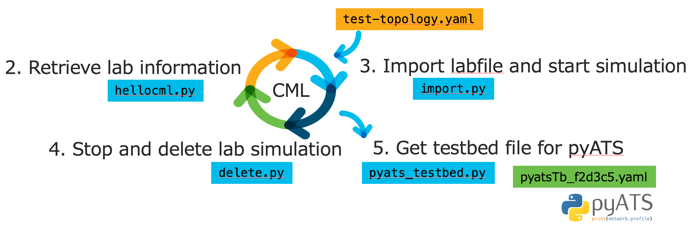

# Cisco Modeling Labs (CML) API Demo for simulation lifecycle

## 1. Get authentication Token
### auth.py

## 2. Get Simulated labs information on CML
### hellocml.py

## 3. Import and start a lab simulation with lab file (yaml)
### import.py
### test-topology.yaml

## 4. Delete a simulated lab
### delete.py

## 5. Get a testbed file (yaml) for pyATS
### pyats_testbed.py